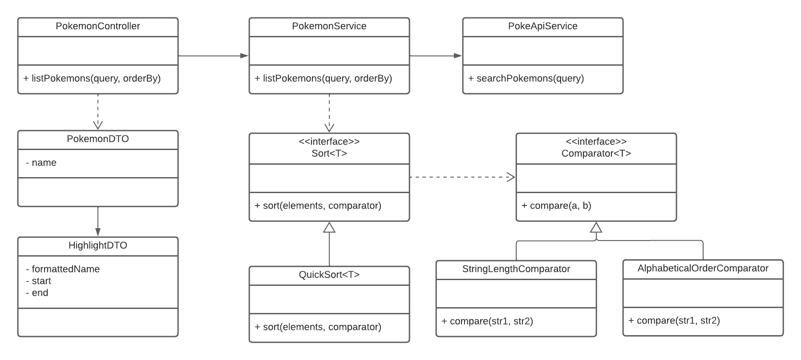

# PokeApi Microsservice

PokeApi microsservice that consumes [PokeApi](https://pokeapi.co/).

## Running

Excute the project by the command below. You can access it at [locahost:3000](localhost:3000).

```
gradle bootRun
```

## Api

### List Pokemons

List pokemons based on name substring.

`GET /pokemons?q=<query>&orderBy=<orderBy>`

Parameters:

| Parameter | Description | Values |
| --------- | ----------- | ------ |
| q         | Pokemon's name substring that will filter results | String |
| orderBy   | Type of results sorting | length ; alphabetical |

Request:

```bash
curl --location \
     --request GET \
     'localhost:3000/pokemons?q=bul&orderBy=length'
```

Response:

`Status: 200 OK `

```json
[
    {
        "name": "granbull",
        "highlight": {
            "formattedName": "gran<b>bul</b>l",
            "start": 4,
            "end": 7
        }
    },
    {
        "name": "snubbull",
        "highlight": {
            "formattedName": "snub<b>bul</b>l",
            "start": 4,
            "end": 7
        }
    },
    {
        "name": "tapu-bulu",
        "highlight": {
            "formattedName": "tapu-<b>bul</b>u",
            "start": 5,
            "end": 8
        }
    },
    {
        "name": "bulbasaur",
        "highlight": {
            "formattedName": "<b>bul</b>basaur",
            "start": 0,
            "end": 3
        }
    }
]
```
# Arquitecture



# Docker

Before creating image you must build project.

```bash
gradle build
```

Then, you can use `docker-compose` to run the container.

```bash
docker-compose up -d
```

You can access the system at [localhost:3000](localhost:3000). To stop the system
execute the command below.

```bash
docker-compose down
```